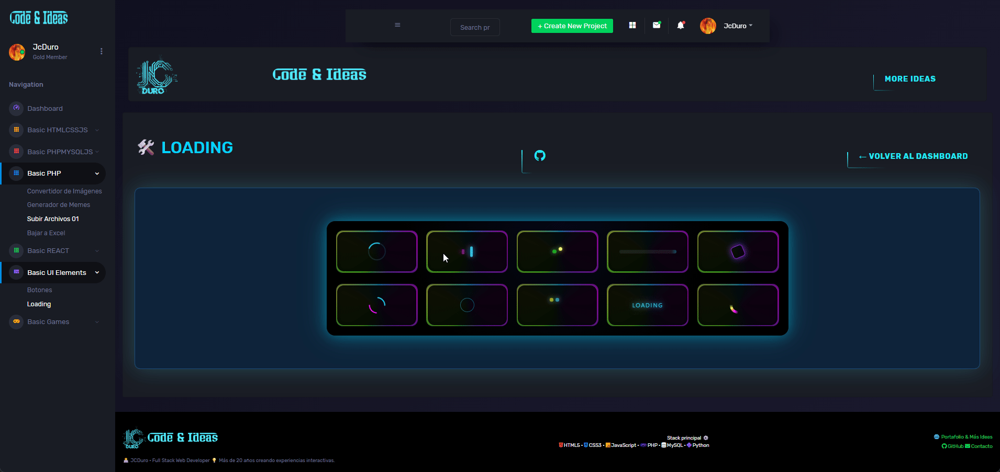

## ⚡ Neon Loaders Panel

Panel de 10 loaders neón, para usar como pantalla de carga dentro de la pagina Web, pensado para mostrar animaciones ligeras mientras se cargan páginas o módulos vía PHP/AJAX. 

---

## ✨ Vista previa

> **

--- 

## ✨ Pruebalo Online

[Loaders_Neon](https://jcduro.bexartideas.com/proyectos/dashjc/load/load.php)

--- 

## 🚀 Features

- 10 loaders neón distintos: anillos, barras, puntos, texto y formas geométricas.
- Distribución responsiva en dos filas (5 arriba y 5 abajo), adaptable a tablet y móvil.
- Efectos glow usando `conic-gradient`, sombras y variables CSS de la paleta del dashboard.
- Implementación 100% HTML + CSS, sin dependencias JS externas para la animación. 

---

## 📊 Lenguajes y Herramientas

---

## 🛠️ Tech Stack

- **Frontend:** HTML5, CSS3 (flexbox, grid, `@keyframes`, `conic-gradient`).
- **Estilo:** Paleta neón basada en `--landing-neon:#04d9ff;` más variantes rosa, morado, verde y amarillo. [memory:5][memory:6]
- **Entorno:** Integrado en `load.php` dentro del dashboard PHP.  

---

## 📦 Estructura del Proyecto

- `load.html`  
  - Contenedor principal `.loaders-wrapper`.
  - Dos filas `.loaders-row` (`.top-row` y `.bottom-row`) con 5 `.loader-box` cada una.
  - Cada caja contiene un `.loader` con una animación diferente (de `.loader-1` a `.loader-10`).  

---

## ⚙️ Uso

1. Incluir el contenido de `load.html` en el módulo de carga del dashboard (por ejemplo, como vista independiente o parcial PHP).
2. Asegurarse de tener definidas las variables CSS de color, especialmente `--landing-neon`, en el CSS global del dashboard.
3. Mostrar u ocultar el panel de loaders mientras se cargan otras páginas:
   - Mostrar `load.html` antes de lanzar la petición.
   - Ocultar o reemplazar el panel una vez completada la carga (por ejemplo, al terminar una llamada AJAX o después de incluir otra vista PHP). [web:26][web:29]

---

## 🔧 Personalización

- Cambiar colores neón editando las variables CSS (`--neon-pink`, `--neon-purple`, etc.) para adaptarlos a otros temas del dashboard.
- Ajustar tamaño de cada loader modificando `width`, `height` y `border-radius` dentro de las reglas `.loader-*`.
- Reutilizar loaders individuales llamando solo a la caja que se necesite (por ejemplo, incluyendo únicamente `.loader-3` como indicador de carga en un módulo específico). [web:29]
